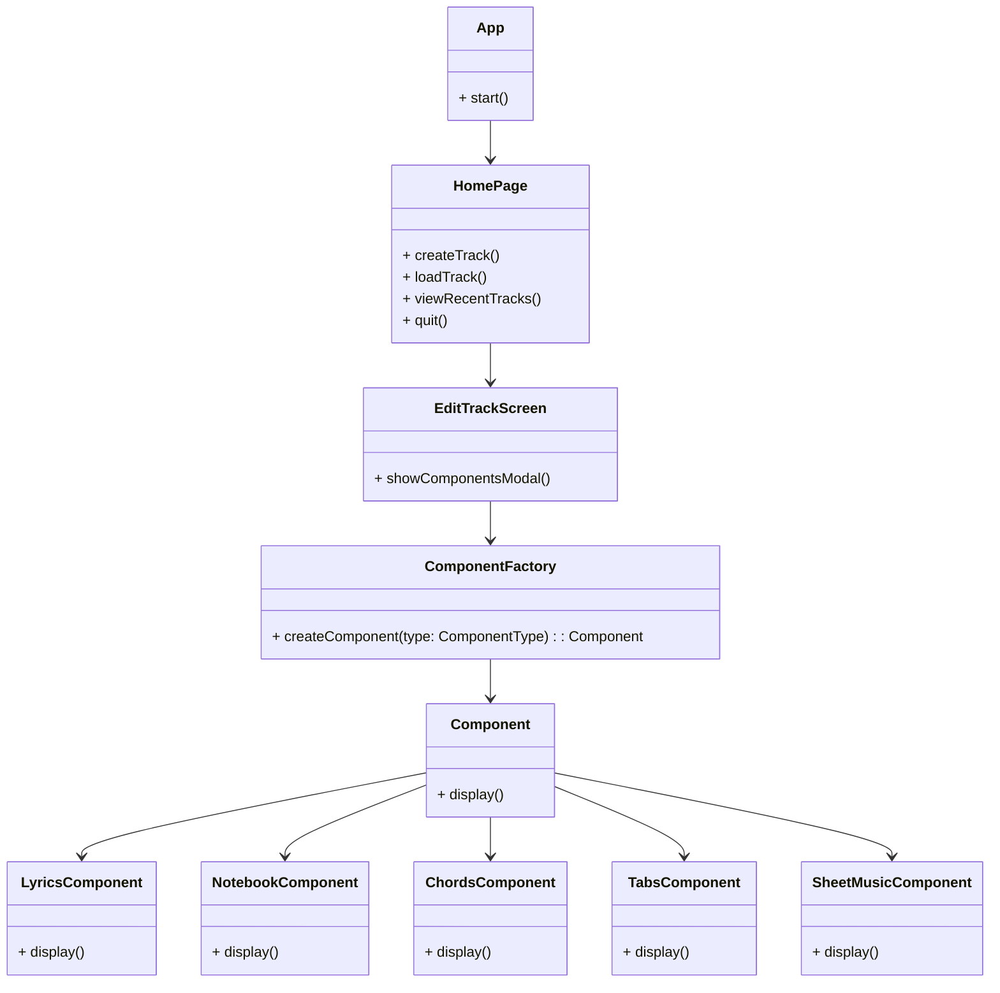

```mermaid
classDiagram
  class App {
    + start()
  }

  class HomePage {
    + createTrack()
    + loadTrack()
    + viewRecentTracks()
    + quit()
  }

  class EditTrackScreen {
    + showComponentsModal()
  }

  class ComponentFactory {
    + createComponent(type: ComponentType) : Component
  }

  class Component {
    + display()
  }

  class LyricsComponent {
    + display()
  }

  class NotebookComponent {
    + display()
  }

  class ChordsComponent {
    + display()
  }

  class TabsComponent {
    + display()
  }

  class SheetMusicComponent {
    + display()
  }

  App --> HomePage
  HomePage --> EditTrackScreen
  EditTrackScreen --> ComponentFactory
  ComponentFactory --> Component
  Component --> LyricsComponent
  Component --> NotebookComponent
  Component --> ChordsComponent
  Component --> TabsComponent
  Component --> SheetMusicComponent
```
